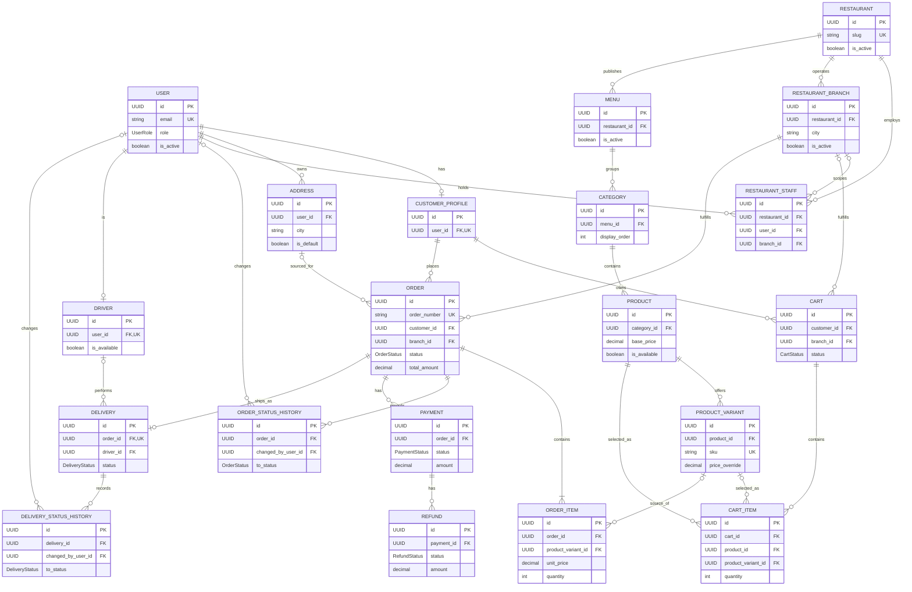

# Entity Relationship Diagram

Final schema nullability: an empty `CART` may have no branch, and `CART_ITEM.product_variant_id` is optional while `product_id` is required. The first item explicitly selects the branch.

The diagram represents exactly the 20 required business entities. `RESTAURANT_STAFF` is the required membership entity that implements the meaningful User–Restaurant many-to-many relationship.

`CART.branch_id` may be null while empty; `CART_ITEM.product_variant_id` is optional, while `product_id` is required. `ORDER_ITEM.product_variant_id` is nullable to preserve historical orders if a catalogue variant is retired. See [data_model.md](data_model.md) for full nullability.
